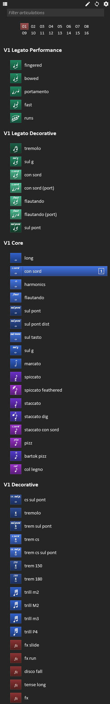
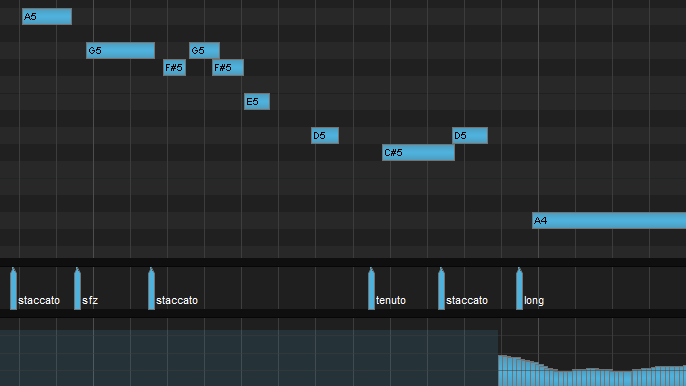

## tl;dr

Install it with [ReaPack](https://reapack.com/):

```
https://someurlhere/
```

This is an alpha preview.  Please [report the bugs you inevitably find via GitHub](https://github.com/jtackaberry/reaticulate/issues).


## What is Reaticulate?

Reaticulate provides a system for managing virtual instrument articulations in REAPER.  Highlights include:
- Simple, (hopefully) attractive, dockable UI
- Highly flexible output events to control the underlying patches in just about every imaginable configuration
- Articulations are chased and clearly labeled on the piano roll
- Coexists with manual triggering of instrument keyswitches
- A number of factory banks for a variety of vendors are bundled to get you started

Reaticulate is [free and open source](https://github.com/jtackaberry/reaticulate).




## How do I install it?

Reaticulate is installable as a ReaPack repository.  If you don't already have ReaPack,
[head on over to reapack.com and install it](https://reapack.com/).

Once you have ReaPack installed:
- Open the menu: `Extensions | ReaPack | Import a Repository`
- Paste in this URL: `TODO`
- Double click the newly added Reaticulate item in the repository list
- Click the `Install/update Reaticulate` button and select `Install all packages`
- Invoke the action `Script: Reaticulate_Main.lua` from the actions list.
    - Pro tip: you can automatically run the script on startup by using
      [SWS](http://www.sws-extension.org/)'s `Set global startup` action


## How does it work?

Reaticulate builds upon Reabank files by extending the semantics of a program change
to trigger custom events needed to switch articulations.  By leveraging program changes as
the unit of articulation control, we get program chasing and a readable view in the
MIDI editor (as seen above) for free.

You can activate an articulation by:
- Clicking in the GUI
- Using the `Reaticulate_Activate *` family of actions
- Manually hitting the keyswitch of the underlying patch (which Reaticulate detects
  and reflects in the UI)

Apart from a custom icon, color, and label (seen right), each program can have one or more
output events associated with it.  The output event is used to trigger the articulation
change on the underlying patch and/or to setup routing to a destination MIDI channel.
Output events can be:
- CC value
- note on/off
- note held
- program change
- simple channel routing (with no special output event) for e.g. multis

When articulations are spread across multiple destination channels, Reaticulate prevents
note hanging and ensures that CCs are properly chased.


## Use cases

The Reaticulate screenshot to the right shows multiple banks associated with the track
which hosts a Kontakt instance containing all the combination patches for Spitfire
Chamber Strings Violins I.  (These are all available in the distributed factory banks.)
As with all Reaticulate factory banks for Spitfire Audio, they expect the Spitfire
patches to be set to Locked to UACC.  Then, each articulation program outputs the
appropriate CC32 value to trigger an articulation change on the Spitfire patch.

This is just one of many, many possible configurations.  Other example use-cases are:
- Note-based keyswitches, including non-latching keyswitches requiring held notes (e.g. Bohemian Violin)
- Individual articulation patches set to different MIDI channels
- Articulations requiring multiple output events (e.g. to set legato on/off, sordino, etc.)
- Layer selected articulations with other patches on different channels


## Groups


Reaticulate also supports up to 4 "articulation groups" per bank.  A group is a set of articulations
that are mutually exclusive  within the group, but articulations between groups may be simultaneously
active.

One example is to have legato on and legato off in one group, con sordino and senza sordino in
another group, and then all other articulations in yet a third group.  (As with, for example,
Cinematic Studio Strings seen right.)


## Reaticulate-notated Reabank files

Unfortunately at the moment there's no GUI for configuring banks, so you're required to
bust out your trusty text editor and hack up your own Reabank file, with the special
notations used to direct Reaticulate's behavior.

<p class='warning'>
    <a href='reabank.html'><b>Click here to learn how to create your own custom banks for Reaticulate</b></a>.
</p>