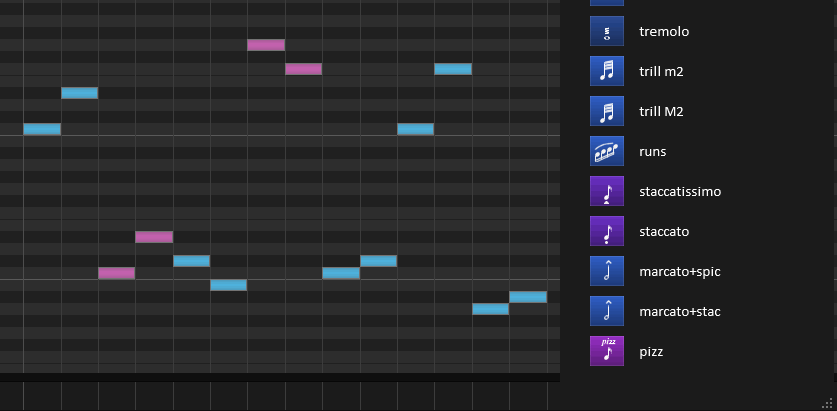
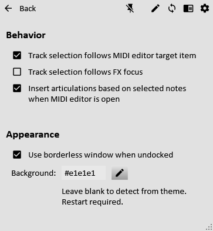
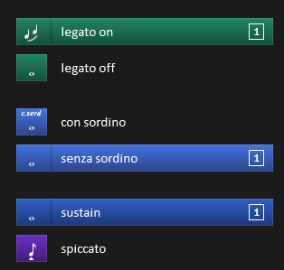
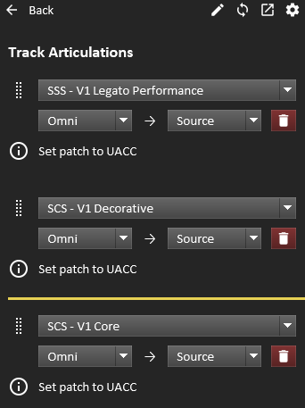

# Reaticulate 0.4.1 Released
*November 4, 2019*

0.4.1 tidies up a few loose threads that slipped through in 0.4.0.

## Full Change Log

### Bug Fixes

* Fixed a bug with the inline MIDI editor when the option to insert articulations at selected notes was enabled
* Fixed a related bug where articulations would fail to insert at the edit cursor if the active item in the MIDI editor was different than the one under the edit cursor
* When "Track selection follows MIDI editor target item" is enabled, don't vertically scroll the arrange view to show the track as that behavior ends up being particularly obnoxious


# Reaticulate 0.4.0 Released
*November 2, 2019*

The next major release of Reaticulate is now available.  Users of both the
pre-release and stable ReaPacks will automatically receive this update.

Although this release includes many new features and workflow improvements, the
bulk of the work has been on a significant internal overhaul of how the main UI
script interacts with the per-track Reaticulate JSFX instances. This isn't
something directly visible to users, but it opens the door to many new features
and improvements that weren't previously possible, some of which are now
available in this release.

Reaticulate 0.4.0 is backward compatible with previous projects, but old
versions are not _forward compatible_ with this new version.  This means
projects saved with Reaticulate 0.4.0 will not function properly with older
versions.  It's a good idea to have backups of your projects until you're
confident downgrading won't be necessary.

**Note: Reaper 5.97 (released on February 21, 2019) or later is now required.**


## Release Highlights


### Articulation Insertion on Selected Notes

When notes are selected in the MIDI editor and an articulation is inserted (e.g.
by right- or double-clicking an articulation in the UI), program change events
can now be added at the first note of any contiguous subset of selected notes.

The channel of the program changes will also match the notes they are being
inserted under, rather than the default channel picked from the channel rows in
the UI.

When no notes are selected, or when the MIDI editor is closed, articulations
will continue to be inserted at the edit cursor.

This new behavior is currently optional while we get a better sense of how it
should mature over time, and can be enabled or disabled from Reaticulate's
Settings page.  It's enabled by default.




### Multiple MIDI Buses

Output events, bank assignments on tracks, and generally anywhere destination
channels could be specified can now optionally include a MIDI bus number as
well.

This capability allows more easily targeting different VSTi plugins on the same
track, by assigning the instances to different buses for MIDI input in Reaper.
This also enables better integration with Vienna Ensemble Pro.

Output events can target different buses by adding `.<bus>` to the channel
descriptor.  As with channel numbers themselves, if the bus isn't included, then
the bus chosen for the destination channel when the bank is assigned to the
track will be used.

Here are some examples:

```go
// This sends note 20 on channel 3 to the bus chosen in the track configuration
// because the bus is not specified in the output event.
//
//! o=note@3:20
1 example 1

// This sends note 20 on channel 7 on bus 5, regardless of the destination channel
// in track configuration.
//
//! o=note@7.5:20
2 example 2

// This sends note 20 on bus 2 to the channel chosen in the track configuration
// because channel isn't specified in the output event.  This is similar to
// example 1 except the bus is explicitly set instead of channel.
//
//! o=note@.2:20
3 example 3
```


### User Experience Enhancements


Reaticulate now handles light Reaper themes much better, ensuring text and icons
are higher contrast.  Theme background color detection has been fixed on Mac,
and there is also now a setting to configure a *custom* background color.

Undocked windows can now be borderless, provided a sufficiently recent version
of the [js_ReaScriptAPI extension](https://forum.cockos.com/showthread.php?t=212174)
is installed.  This option can be enabled in Reaticulate's Settings page.  (The
option will not be visible if js_ReaScriptAPI is too old or not installed.)

In addition to right-clicking, articulations in the UI can now be double-clicked to
insert articulation changes into MIDI items.

Finally, previous versions did not respect Undo with articulation insertions.
This has been fixed with 0.4.0, so articulations inserted into MIDI items can be
reverted with Reaper's normal undo facility.


### New Articulation Capabilities

All the new features described below are fully documented on the [Bank Files page](reabank).

#### Note Transformations

Four new articulation attributes have been added to perform basic transforms to
incoming notes after the articulation is activated:

* `transpose` will shift note pitches by the specified amount
* `velocity` is a multiplier that will be applied to note velocity values
* `pitchrange` will clamp note pitches to the specified min and max values
* `velrange` will clamp note velocities to the specified min and max values

Here are some examples:

```go
// Shift played notes down an octave
//
//! transpose=-12 o=@1
1 8vb longs

// Increase note velocity by 2.5x to simulate an accent.
//
// velocity=2.5 o=@2
2 staccato accent

// Limit notes to playable range for this restricted artculation
//
// pitchrange=55-74 o=@3
3 sul g
```


#### Pitch Bend

A new `pitch` output event has been added to send pitch bend MIDI messages when
articulations are triggered.  Values are between -8192 and 8192.

```go
// Send a pitch bend to channel 3 bus 2.
//
//! o=pitch@3.2:-1250
1 example
```

Pitch bends aren't automatically reset to 0 when another articulation is
activated.  You would need to specify that explicitly in the other articulations' output events.


#### Use Previous Routing for Output Events

A special channel value of `-` (dash) will send the output event to the destination
channel(s) set up by the previous articulation.  Future incoming MIDI events for
performance will continue to be routed to those channels.

```go
//! o=cc@1:32,1
1 long ch 1

//! o=cc@2:32,42
42 spiccato ch 2

//! o=cc@-:32,7
7 con sord on existing channel
```

#### Visual Spacing Between Articulations

A new `spacer` articulation attribute allows visually separating groups of articulations.  Articulations with this attribute will be shown in Reaticulate's UI with spacing above.  The value indicates the degree of spacing, but `1` is generally a good default.


```go
//! c=legato i=legato g=2 o=cc:58,76
20 legato on
//! c=legato i=note-whole g=2 o=cc:58,81
19 legato off

//! spacer=1
//! c=long-light i=con-sord g=3 o=cc:58,86
7 con sordino
//! c=long-light i=note-whole g=3 o=cc:58,91
2 senza sordino

//! spacer=1
//! c=long i=note-whole o=cc:58,1
1 sustain
//! c=short i=spiccato o=cc:58,11
42 spiccato
```

## Full Change Log


### New Features

* This release introduces support for multiple MIDI buses.  Anywhere previously involving a destination MIDI channel can now optionally include a MIDI bus number as well.  Among other things, this allows for better integration with Vienna Ensemble Pro. ([#73](https://github.com/jtackaberry/reaticulate/issues/73))
* Articulation insertion now respects selected notes when the MIDI editor is open.  Program changes will be inserted intelligently based on the nature of the selection.
* Articulations can now define transformations to incoming notes after the articulation is activated.  These include transposing the notes, a velocity multiplier, and pitch and velocity range clamping. ([#72](https://github.com/jtackaberry/reaticulate/issues/72))
* Output events can now be routed to destination channels set up by the previous articulation by using `-` as the channel ([#42](https://github.com/jtackaberry/reaticulate/issues/42))
* Output events can now send pitch bend MIDI messages ([#60](https://github.com/jtackaberry/reaticulate/issues/60))
* Double clicking an articulation or invoking any of the "activate articulation" actions twice within 500ms will force-insert the articulation in the MIDI item.  (This is equivalent to right clicking, which behavior still exists.)
   - The old behavior of always inserting when step record is enabled has been removed in favor of this consistent approach.
* Much better support for light themes ([#6](https://github.com/jtackaberry/reaticulate/issues/6))
* Added option for undocked windows to be borderless (requires a fairly recent version of the js_ReaScript_API extension)
* Allow user-configurable background color (in Settings page) ([#78](https://github.com/jtackaberry/reaticulate/issues/78))


### Minor Enhancements

* Added a new `spacer` articulation attribute which adds visual padding above the articulation when shown in Reaticulate's UI ([#66](https://github.com/jtackaberry/reaticulate/issues/66))
* Bank messages (set with the `m` attribute in the bank definition) can now be viewed from Reaticulate's main articulation list screen ([#68](https://github.com/jtackaberry/reaticulate/issues/68))
* Improved text entry widget behavior with text selection, copy/paste, etc.
* Errors and other problems with banks or track configuration are now more visible in the articulation list screen
* Linux: preliminary support
* Added tremolo-180-con-sord icon
* Many other small GUI refinements, especially on Mac


### Bug Fixes

* Fixed problem where insertion of articulations could not be undone by Reaper's undo action ([#47](https://github.com/jtackaberry/reaticulate/issues/47))
* Fixed bug where `art` type output events combined with filter programs could hang Reaper (infinite loop) ([#44](https://github.com/jtackaberry/reaticulate/issues/44))
* Fixed bug where activating an articulation that acts as a filter to another articulation's `art` output events could activate the wrong child program
* Fixed bug when MIDI controller feedback was enabled where Reaticulate would sometimes install sends to the wrong track when a new project was opened
* Avoid reloading all other track FX when Reaticulate is installed on a track ([#1](https://github.com/jtackaberry/reaticulate/issues/1))
* Mac: use the Reaper theme background color for Reaticulate's window
* Fixed bug when opening the Reabank file editor on Windows when the path contained spaces
* Fixed rare crash when last touch fx becomes invalid
* Factory banks: Fixed trills and tongued legato for the Herring Clarinet
* Do not clear serialized variables in @init per JSFX docs ([#65](https://github.com/jtackaberry/reaticulate/issues/65))


<details>
<summary>Show older news ...</summary>


# Reaticulate 0.3.2 bugfix release
*August 4, 2019*

This is release fixes a regression introduced in 0.3.0.

### Bug Fixes

* Fix articulation activations during live recording


# Reaticulate 0.3.1 bugfix release
*June 19, 2019*

This is a small bug fix release, mostly to fix a nontrivial regression introduced in 0.3.0.

### Bug Fixes

* Fix bug where custom user banks would show up in the Factory submenu instead of the User submenu
* Fix bug where sometimes the GUI would not adjust after resizing its dimensions
* Allow long bank messages to wrap in the Track Settings screen


# Reaticulate 0.3.0 Released
*June 17, 2019*

This release of Reaticulate focuses on general usability improvements and
knocking down those little workflow irritations.  Apart from that, there are
quite a number of internal structural changes that you don't see, but will help
pave the way for future releases.

For those who installed Reaticulate via ReaPack, the updates should come
automatically in time, but you can force the update by accessing `Extensions |
ReaPack | Synchronize packages` from Reaper's menu.

After the update, you should restart Reaper to ensure the latest version of all
Reaticulate scripts are running.

## Full Change Log

These are the changes since 0.2.0.

### New Features
* Articulations are now fed back to control surface ([#48](https://github.com/jtackaberry/reaticulate/issues/48))
   * CC0/32 bank select indicates bank for articulation
   * Articulations can be expressed either as native program change events or custom CC events
* When the [js_ReaScriptAPI extension](https://forum.cockos.com/showthread.php?t=212174) is installed (**strongly recommended!**):
   * You can now pin the Reaticulate window when floating
   * Some new actions and features become available
   * Much improved focusing behavior
* New action "Focus articulation filter" (which works best when the js_ReaScriptAPI extension is installed)
* New action "Activate articulation slot number by CC on default channel" which can be used to activate articulations based on their position in the bank list ([#58](https://github.com/jtackaberry/reaticulate/issues/58))
* New action "Insert last activated articulation into MIDI item on default channel" to insert the last activated articulation into MIDI item at edit cursor (same behavior as right clicking the articulation)
* New option "Track section follows focused FX window" (with associated toggle action) (requires js_ReaScriptAPI extension)
* New option "Track selection follows MIDI editor target item" (with associated toggle action)
   * This is most conveniently paired with the "Options: MIDI track list/media item lane selection is linked to editability"
* New action "Select last selected track"
* Various new actions to select but not activate articulations, plus an action to activate currently selected articulation ([#59](https://github.com/jtackaberry/reaticulate/issues/59))
  * Running the action to activate currently selected articulation twice in rapid succession will cause it to insert into MIDI item
* On pages that scroll, scrollbars will appear when the mouse hovers toward the right edge


### Minor Enhancements
* Added a new "Behaviors" section on Settings page
* Activating an articulation now scrolls it into view in the GUI ([#50](https://github.com/jtackaberry/reaticulate/issues/50])
* Improved First Run experience (especially for portable Reaper installations) ([#46](https://github.com/jtackaberry/reaticulate/issues/46))
* Minor cosmetic improvements with drag-and-drop to reorder banks on the track configuration page

### Bug Fixes

* Fixed regression in control surface feedback when reopening a project
* Force control surface update on track selection (workaround for https://forum.cockos.com/showthread.php?p=2077098)
* Ensure articulations on same MIDI tick as notes are processed before the notes ([#53](https://github.com/jtackaberry/reaticulate/issues/53))
* Other minor fixes


# Reaticulate 0.2.0 Released
*July 2, 2018*

After a longer-than-expected development cycle, I'm happy to release the next alpha version of
Reaticulate.

I'm hoping the next major release will be beta worthy.  The main release criteria for beta is a GUI
editor for creating and modifying banks.


## Upgrade Instructions
<p class='warning'>
    Important note: this version requires reinstallation with a new ReaPack URL.
</p>

Unfortunately due to significant backward-incompatible changes in the ReaPack structure, upgrading
requires __uninstalling the old version__ and installing the new one.

I did warn you this was alpha software, right? :)

Follow these steps to uninstall the old version:

1. Close current project (if one is open)
1. Menu: `Extensions | ReaPack | Manage Repositories`
1. Right click Reaticulate and click Uninstall
1. Click ok and say yes to the prompt
1. Restart Reaper (necessary to stop existing Reaticulate instance)


And now follow the [installation instructions](download).

Reaticulate itself is fully backward compatible with the previous version, so all your existing
projects will work with the new version.  However, the old version is not _forward compatible_ with
this new version, so projects saved with Reaticulate 0.2.0 will not function properly in Reaticulate
0.1.0.

It's a good idea to save backups of your projects before resaving with Reaticulate 0.2.0
just in case you find yourself needing to downgrade to Reaticulate 0.1.0.

This will be generally true of all releases (i.e. backward compatible but not forward compatible).


## Release Highlights

### MIDI CC Feedback to Control Surface

If you do realtime performance of your MIDI CCs using a control surface that supports incoming
feedback, such as a MIDI Fighter Twister or iCON Platform-M, it's possible to have
Reaticulate-managed tracks sync their current CCs back to the control surface, either on track
select or during playback.

There are some new actions to control this behaviour, including to enable or disable it, or to
do a one-time dump of current CCs to the control surface.

See the [Usage page](usage#cc-feedback-to-control-surface) for more details.



### Usability Enhancements

One of the most requested features was the ability to insert program change events in MIDI items
without the need to open the MIDI editor and enable step input.  This is now possible by __right
clicking__ an articulation in the list.

Banks in the track configuration page can now be reordered via drag and drop (depicted right)
rather than the cumbersome up/down buttons in the previous release.

The Settings Page now has an option to autostart Reaticulate when Reaper starts.  This works by
modifying Reaper's special `__startup.lua` script to invoke the `Reaticulate_Start` action.

There are a few other little odds and ends improving usability.  For example, if the Reaticulate UI
panel has focus and the spacebar is hit, it will toggle transport play/pause and move focus back to
the arrange view (or MIDI editor if it's open).  Unfortunately there's no way to solve this problem
in a general sense (passthrough keystrokes to the arrange window) but play/pause was the single biggest
workflow killer for me, so hopefully you find it helpful too.


### New Articulation Capabilities

All these new features described below are fully documented on the [Bank Files page](reabank).

#### Articulation Chaining
There's a new output event type `art` which allows articulations to be chained.  Consider the
following bank:

```go
//! c=long i=note-whole o=art:3/art:19/art:2
1 all-in-one long

//! c=long i=note-whole o=note:12
3 sustain
//! c=legato i=legato g=2 o=note:22,65
20 legato on
//! c=legato i=note-whole g=2 o=note:22,1
19 legato off
//! c=long-light i=con-sord g=3 o=note:23,65
7 con sordino
//! c=long-light i=note-whole g=3 o=note:23,1
2 senza sordino
```

This bank models a patch that has separate keyswitches for legato on/off and con sord on/off, which
are placed in different groups.  You can activate them independently, but the all-in-one long on
program 1 references the other articulations to provide a convenient, er, all-in-one articulation.

When you activate it, the GUI will automatically update to reflect the legato and sordino states.


#### CC Chasing Improvements

Previously, if Reaticulate observed _any_ CC then it would chase it.  This ended up doing
frustrating things, such as zeroing out CC 7 (volume) at unexpected times.

Now banks can specify which CCs should be chased.  The factory banks have been updated accordingly.
And now by default, unless a bank specifies a CC list, only CCs 1,2,11,64-69 will be chased.


#### Output Events Without Affecting Routing

Sometimes you just want an articulation to fire a MIDI event to a specific channel but not have future
non-articulation events get routed to that channel.

This is now possible by prefixing the output event type with a `-`.  For example:

```go
//! o=-note@13:42/note@10:20
```

The special `-` prefix in the first note output event tells Reaticlate _not_ to setup routing of
future events to channel 13.  Meanwhile, because the second note output event isn't so prefixed,
subsequent events will get sent to channel 10.


#### Conditional Output Events

It's now possible to have output events emit only if another articulation is active.  We call this a
_filter program_ and it requires that the filter program be activated in another group on the same
channel, otherwise the output event will be filtered (i.e. not emitted).

This allows articulations to be contextual based on articulations in other groups.

Filter programs are optional, and are specified by appending `%program` to the output event spec.

For example, consider a library such as Berlin Brass with its expansion packs, where trumpet
articulations can be performed unmuted, or with straight mutes, or with harmon mutes.  You _could_
have separate programs for each articulation with each type of mute -- and this is a perfectly
cromulent approach to be sure -- but it's now also possible to have a single program for each
articulation and the type of mute be defined in another group.

```go
//! c=long i=note-whole g=2
120 unmuted
//! c=long-light i=stopped g=2
121 straight mute
//! c=long-light i=stopped g=2
122 harmon mute

//! c=long i=note-whole o=note:24@1%120/note:24@2%121/note:24@3%122
1 long
//! c=short i=staccato o=note:27@1%120/note:27@2%121/note:27@3%122
40 staccato
//! c=short i=marcato-quarter o=note:28@1%120/note:28@2%121/note:28@3%122
52 marcato
```

So here we have the mute types in group 2, and the articulations in group 1.  This example describes
a multi, where the unmuted patch (the one that comes with the base Berlin Brass library) is on
channel 1, the straight mute variant is on channel 2, and the harmon mute variant on channel 3.

Here when activating the long articulation, only one of the output events will be emitted, depending
on the state of group 2.

If one of the mute types in group 2 is changed later, Reaticulate understands that it must retrigger
program 1 and emit the new note output event on the other channel, and redirect future MIDI events
to that channel.

The standard caveat of using multiple groups with Reaticulate applies: Reaper will only chase the
last program on each channel, so if you have a MIDI item with e.g. program 120 followed by program
1, and you manually activate program 121, when you begin playback again, depending on the playhead
position, program 120 may not be refired.

In spite of that limitation, this new ability to filter output events based the state of other
groups provides a lot of interesting capabilities.


### Additional Documentation

There is now the beginnings of a user manual on the [Usage page](usage).  It's a bit
information-dense right now but I intend to polish it up over time.


## Full Change Log
### New Features

- Added support for MIDI CC feedback to a control surface or other controller
- Articulation output events may refer to other articulations in the same bank via new 'art' output type (#18)
- Articulations can now be inserted from the arrange view (or MIDI editor without step input needing to be enabled) by right clicking the articulation button (#28)
- Banks can now specify which CCs should be chased.  Factory banks are much more selective about what's chased. (#33)
- Added support for conditional output events, where output events may now be optionally dependent on the state of articulations in other groups (#32)
- Output events to specific target MIDI channels can now be optionally configured to not affect future routing (#30)
- Added Settings UI to configure Reaticulate to autostart when Reaper starts

### Minor Enhancements
- Spacebar in Reaticulate's window will now toggle transport and focus arrange view
- Bank list in track configuration can now be reordered via drag-and-drop (#37)
- Ctrl-left/right now skips words in the articulation filter text input box (#9)
- Existing program changes at edit cursor will be removed before inserting a new one (#35)

### Bug fixes
- Fixed problem where UI may not use correct background color from theme
- Fixed parsing of invalid colors and icons (#13)
- Fixed "Add Reaticulate FX" button not working after first install (#15)
- Fixed ultra critical bug where trill-min2 and trill-maj2 icons were swapped (#16)
- Fixed routing issue when articulation had no output events defined (#27)
- For articulations with multiple note outputs, all note-ons will now be sent before any note-offs (#20)
- Articulations with multiple note-hold outputs now works as expected (#26)
- Fixed embarrasing bug where channel 16 couldn't be used for bank's source channel
- Reduced the likelihood of Reaticulate munging the last touched FX
- Other minor bug fixes

</details>
