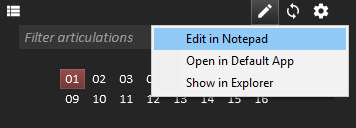
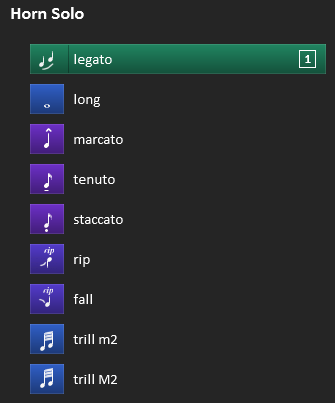
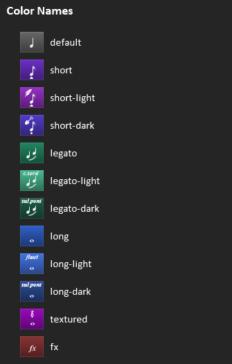

## Reaticulate notations for Reabank files

<p class='warning'>
    In the alpha preview of Reaticulate, there is no GUI for creating custom banks.
    It'll come, but for now, you'll need to understand the nitty gritty on this page.
</p>


Reaticulate directly manages REAPER's assigned global Reabank file, which it dynamically
assembles from both the distributed factory banks and your own custom banks.  Relative to
REAPER's resource directory (which you can find by invoking the REAPER action "Show REAPER
Resource path"), these files are:

1. Factory banks: `Scripts/Reaticulate/Reaticulate-factory.reabank`
2. User banks: `Data/Reaticulate.reabank`

(Reaticulate combines these files into a file it manages called `Data/Reaticulate-tmp*.reabank`.
You'll never edit this file directly, but it's what Reaticulate feeds back to REAPER to use as
the default reabank file.)



You can take a look at the factory banks for inspiration, but if you want to start slinging
your own custom articulation banks, the easiest way is to click the pencil button at the
top of the UI and open the file in your editor.  Clicking this will create the file if
necessary before opening the editor.  Open in Default App will launch whatever application
you've associated with `.reabank` files.

<p class='warning'>
    Once you save changes to the file, click the reload button (next to the pencil) to force
    Reaticulate to pick up the changes.
</p>

## Anatomy of a standard Reabank file

Let's take a look at the normal REAPER reabank file.  The standard format is:

```
Bank <MSB> <LSB> <Bank name>
<program #> <articulation name>
```

For example:

```go
Bank 65 1 Spitfire Symphonic Brass - Horn Solo
20 legato
1 long
52 marcato
50 tenuto
40 staccato
100 rip
101 fall
70 trill m2
71 trill M2
```

The two numbers on the Bank line indicate the MSB and LSB of the MIDI bank.  These values are
between 0 and 127 and are somewhat arbitrary, as long as the pair is unique to the REAPER
instance. Following that is an arbitrary name for the bank.

<p class='warning'>
    User banks must use MSBs from 0 to 63.  MSB of 64 and above are reserved for factory banks.
</p>

Each subsequent line (until the next Bank line) specifies the programs for the bank.  The number is
the MIDI Program Change event number (which is technically arbitrary but see the
[Program Numbers](#program-numbers) section below for some advice), and the description is, in our
case, the name of the articulation.


## Reaticulate notations

Reaticulate extends Reabank files by adding special notations on lines starting with `//!`

Let's revisit the above example bank, now notated for Reaticulate, and how this bank looks
in the GUI:


```go
//! g="Spitfire/Symphonic Brass" n="Horn Solo"
//! m="Set patch to UACC"
Bank 65 1 SSB - Horn Solo
//! c=legato i=legato o=cc:32,20
20 legato
//! c=long i=note-whole o=cc:32,1
1 long
//! c=short i=marcato-quarter o=cc:32,52
52 marcato
//! c=short i=tenuto-eighth o=cc:32,50
50 tenuto
//! c=short i=staccato o=cc:32,40
40 staccato
//! c=short-dark i=rip o=cc:32,100
100 rip
//! c=short-dark i=rip-downward o=cc:32,101
101 fall
//! c=long i=trill-min2 o=cc:32,70
70 trill m2
//! c=long i=trill-maj2 o=cc:32,71
71 trill M2
```

Notated attributes take the form `name=value` (or `name="value"` if the value contains spaces)
and are separated by whitespace.  The line(s) prefixed with `//!` immediately preceding the
uncommented line will annotate it with the supplied attributes.

When an articulation is triggered, Reaticulate will emit the MIDI output events defined by
the ``o`` attribute (see below).  In the above example, each articulation sends a single MIDI
event: CC 32 with a value defined by the second argument.  The expectation for this factory bank
is that the Spitfire Horns Solo patch be set to UACC (a feature of the patch itself).


## Attributes for Bank lines

These are the supported attributes for Bank lines.  Attributes are optional unless specifically
marked as required.

<table>
<tr><th style='text-align: center'>Name</th><th>Description</th></tr>
<tr>
    <td style='text-align: center'>g<br/><code>required</code></td>
    <td>
         Group name separated by slashes.  Used to build a menu hierarchy for the bank.
        Generally should be Vendor/Product.
    </td>
</tr>
<tr>
    <td style='text-align: center'>n</td>
    <td>
        The name of the patch the bank describes.  If not specified, the Reabank name is used.
    </td>
</tr>
<tr>
    <td style='text-align: center'>clone</td>
    <td>
        Clones the articulations <i>from</i> the referenced bank, specified as a fully qualified bank name (i.e. the groupname/bankname format), <i>to</i> the current bank which contains the clone attribute.  The cloned articulations will appear after any articulations explicitly defined in the current bank.
    </td>
</tr>
<tr>
    <td style='text-align: center'>off</td>
    <td>
        For articulations with note-hold outputs, this defines the "default program" when no note-hold
        articulation is active.  The GUI will show this program as active when a manually triggered
        note-hold keyswitch is released.  When this articulation is explicitly activated via Reaticulate,
        it will cause any active note-hold articulation to be released.
    </td>
</tr>
<tr>
    <td style='text-align: center'>f</td>
    <td>
        Default articulation flags. Most can be overridden per articulation. Is a comma-delimited list of one
        or more of the options below.  Any option can be prefixed with <code>!</code> to negate it.
        <ul>
            <li>
                <code>chase</code>: Chase CCs when target MIDI channel changes. (Default)
            </li>
            <li>
                <code>antihang</code>: Prevent note hanging when a note is released on a different
                channel than it's pressed. (Default)
            </li>
            <li>
                <code>antihangcc</code>: Similar to antihang, but prevents the note from hanging due to sustain
                pedal or breath control (CC 2 and 64).  In other words, it ensures sustain release or breath off is
                sent to the channel where the ringing note was struck, regardless of the current routing. (Default)
            </li>
            <li>
                <code>nobank</code>: Blocks the bank select messages generated by Reaticulate from hitting the
                downstream FX. (Default. Bank level only.)
            </li>
            <li>
                <code>toggle</code>: Triggering the articulation when it's active will deactivate it. It will still
                emit the output events but the UI will indicate the articulation as off if it was previously on.
            </li>
            <li>
                <code>hidden</code>: Articulation will not be visible in the UI.  When defined at the bank level
                instead of a specific articulation, the bank will not be available to add to tracks, however
                any existing references to the bank (e.g. in existing projects) will continue to work.
            </li>
        </ul>
    </td>
</tr>
<tr>
    <td style='text-align: center'>chase</td>
    <td>
        Comma-delimited list of CCs (or CC ranges) that should be chased when CC chasing is enabled
        for an articulation (as is default).  For example: 1,2,5,11-21,92-120.  (Default: 1,2,11,64-69)
    </td>
</tr>
<tr>
    <td style='text-align: center'>m</td>
    <td>
        A custom message displayed in the track configuration page and optionally the main
        articulation list screen.  This usually provides some special instructions about how to configure
        the virtual instrument to be compatible with the bank, or other performance details.
    </td>
</tr>
</table>


## Attributes for Program lines

Programs can be decorated with these attributes:

<table>
<tr><th style='text-align: center'>Name</th><th>Description</th></tr>
<tr>
    <td style='text-align: center'>i<br/><code>required</code></td>
    <td>
        Articulation icon name.  See <a href='#articulation-icons'>Articulation Icons</a> section
        below for possible names.
    </td>
</tr>
<tr>
    <td style='text-align: center'>n</td>
    <td>
        Overrides the articulation name for display in the articulation list in the Reaticulate UI.
        Program events as seen in the MIDI editor will use the program name specified on the uncommented
        line.
    </td>
</tr>
<tr>
    <td style='text-align: center'>c</td>
    <td>
        Color for the articulation button.  Either the name of a color (see the
        <a href='#articulation-colors'>Articulation Colors</a> section below)
        or an HTML hex-style color in the form <code>#rrggbb</code>
    </td>
</tr>
<tr>
    <td style='text-align: center'>f</td>
    <td>
        Articulation flags as defined above. (Overrides the defaults set at the bank level.)
    </td>
</tr>
<tr>
    <td style='text-align: center'>g</td>
    <td>
        A group number between 1 and 4 (defaults to 1 if not specified).  Only one articulation within a
        group may be active at a time.<br/><br/>
        For consistency, it is recommended that you use group 1 for the main set of articulations.
    </td>
</tr>
<tr>
    <td style='text-align: center'>o</td>
    <td>
        One or more output events that describe the action taken when the articulation is triggered.<br/><br/>
        This is where things get fun. See the <a href='#output-events'>Output Events</a> section below
        for the gory details.
    </td>
</tr>
<tr>
    <td style='text-align: center'>spacer</td>
    <td>
        Inserts some padding above the articulation when displayed in Reaticulate's main
        articulation list screen.<br/><br/>
        The value is a number that controls the amount of padding but generally a value of
        <code>1</code> will provide a sufficient visual separation.
    </td>
</tr>
<tr>
    <td style='text-align: center'>transpose</td>
    <td>
        A value between -127 and 127 which defines how many pitches incoming notes should be
        transposed after the articulation is activated.
    </td>
</tr>
<tr>
    <td style='text-align: center'>velocity</td>
    <td>
        A multiplier between 0.00 and 10.00 (up to 2 decimals of precision) that will be applied
        to incoming note velocities.  The note-off velocity (if it exists -- it's quite rare)
        will also be multiplied by this value.
    </td>
</tr>
<tr>
    <td style='text-align: center'>pitchrange</td>
    <td>
        A value in the form <code>min-max</code> defining the lower and upper limits that
        incoming note pitch numbers will be clamped to.  For example a value of
        <code>40-70</code> will force all notes with pitch values below 40 to be 40, and
        values above 70 to be 70.
    </td>
</tr>
<tr>
    <td style='text-align: center'>velrange</td>
    <td>
        A value in the form <code>min-max</code> defining the lower and upper limits that
        incoming note velocities will be clamped to.  For example a value of <code>32-64</code> will
        force all notes with velocities below 32 to be 32, and velocities above 64 to be 64.
    </td>
</tr>
</table>

## Program Numbers

Although the __program numbers are arbitary__ and don't influence any specific behavior, some
form of standardization is recommended because this allows using the
`Reaticulate_Activate articulation by CC` actions to trigger a given articulation (or
at least its closest approximation) from a control surface, tablet, etc., no matter the
underlying instrument.

<p class='warning'>
    Reaticulate's factory banks will conform as closely as possible to
    <a href="https://spitfire-webassets.s3.amazonaws.com/pdfs/UACCv2spec.pdf">Spitfire's
    UACC specification</a>.
</p>

So, for example, by consistently using program 42 to map to spiccato, or some similar very
short articulation, you could have a control surface send CC value 42 (via a CC number of
your choice bound to the Activate Articulation action) to set spiccato, no matter what
track is selected.


## Output Events Specification

<p class='warning'>
    This section is a bit nerdy.  It's quite necessary to understand to build your
    own banks, but don't worry, there are some more approachable examples later.
</p>

Programs can trigger up to 16 *output events*, specified by the `o` attribute, which
ultimately describe the articulation's behavior.

Output events can be used to send a MIDI event to the virtual instrument to cause the
underlying patch to change articulations, or even just to set up routing to some
destination MIDI channel.  Or both: you can have a program send a MIDI event to a
specific channel, and subsequently performed MIDI will be routed to that channel.

Multiple output events are separated by a `/` (forward slash) where each individual
output event roughly takes the form `type@channel:arg1,arg2` (no whitespace allowed).

A more formal specification for a single output event would look like this:

```
[-][type][@channel[.bus]][:arg1[,arg2]][%filter_program]
```

Where elements enclosed in square brackets are optional, and where:


* Output events prefixed with `-` don't affect the routing of future MIDI events.  Otherwise, if channels
  are not prefixed this way then any future user-generated MIDI event will be routed to this channel when
  the articulation is activated.

* `type` defines the type of output event (see below), e.g. note, cc, etc.

* `@channel` specifies the destination MIDI channel of the output event and, unless `type` is
  prefixed with `-`, it implies subsequent MIDI events will also be routed to that destination
  channel.

  When channel is not specified, the destination channel will be dictated by the
  destination channel the defined by the user when the bank was configured on the track.  (See the
  [usage page](usage#track-setup) for more information on source and destination channels.)

  Alternatively, a special channel value of `-` will direct the output event to
  the destination(s) setup by the previously activated articulation.

* `.bus` specifies the destination bus of the output event and subsequent incoming
   events when the articulation is activated.  `bus` is a value between 1 and 16.

  As with the channel, if not specified the default bus will be dictated by the
  destination bus for the bank's track configuration. If the bus is defined but
  not the channel (e.g. `@.4`) then then the default channel will be used but
  the bus will be overridden.

  If you use Reaticulate's MIDI controller feedback feature, you won't be able to assign
  bus 16 as this bus is used by the feedback feature internally.

* `arg1` and `arg2` depend on the type

* `%filter_program` if defined will only emit the output event if the specified program number
  `filter_program` is currently active on the same channel in another group.  This allows
  the state of other groups to modify the output events emitted by the articulation.

  For example, you might have an articulation group that specifies normal attack
  vs hard attack with different programs.  A single sustain articulation could
  then emit different keyswitches depending on whether the normal or hard attack
  is selected in the group.

Possible output event types are:

| Type      | Definition
|:---------:|---------------
| program   | Program change message.  `arg1` indicates the program number and `arg2` can be omitted.
| cc        | A CC event, with `arg1` indicating the CC number and `arg2` defining the CC value
| note      | A sequence of note-on and note-off events, where `arg1` defines the note number and `arg2` indicates note-on velocity.  `arg2` is optional and if not specified the default velocity is 127.  (It's not possible to specify the note-off velocity, however.  This is a seldom used feature of MIDI.)
| note-hold | A note-on event, where `arg1` and `arg2` are according to the `note` type.  The corresponding note-off event is deferred until the next articulation is activated.  This is useful with patches that use non-latching keyswitches.
| pitch     | A pitch bend event, where `arg1` is the 14-bit pitch bend value between -8192 and 8192 and `arg2` is not used.
| art       | Activate another articulation in the same bank, with `arg1` being the articulation program number and `arg2` is omitted.  This can be used to create composite articulations.  For example if you have articulation groups for con sordino/senza sordino and legato/non-legato, you could have another composite articulation for non-legato sustain con sordino that references the articulations in the other groups.

Be aware that if multiple `note` output events are specified for a given articulation, all note-on
events will be sent before any note-off event.  This means as far as the target patch is concerned
the notes will be simultaneously pressed.  This is also true for `note-hold` events, except that
of course in that case all the necessary note-off events will be deferred until the next articulation.

The `type` can also be empty, specifying just `@channel`, in which case the action of the
articulation will just be to set up routing to the destination channel specified, with no MIDI event
emitted.

Alternatively, if the type is prefixed with a `-` sign (e.g. `-note`) then the output event is
emitted but routing of subsequent user MIDI events to the output event's destination channel
will not be done.  This can be useful for example to send control events to listeners on other
channels.  If _all_ the output events for the articulation are prefixed this way, then the
destination channel routing setup by the previous articulation won't be altered.


## Output Event Examples

Ok, with the technicals out of the way, here are some examples.


### Multiple notes

This one from Cinematic Studio Strings sends 3 separate notes at specific velocities to set sordino
and legato in addition to the sustains patch.

```go
//! c=long-light i=con-sord o=note:12/note:22,1/note:23,127
7 con sordino
```

### Simple channel routing

A generic example where we have 3 individual articulation patches on 3 separate MIDI channels and we
want to do simple routing only: no keyswitches needed by the underlying virtual instrument.

```go
//! c=legato i=legato o=@1
20 legato
//! c=long i=note-whole o=@2
1 sustains
//! c=short i=staccato o=@3
40 staccato
```

### One-off layering

Here's another one from Cinematic Studio Strings, setting up spiccato without sordino. The twist is
the "beefy spiccato" program, where we are setting CSS as with spiccato but also layering it with
another patch on channel 2.

```go
//! c=short i=spiccato o=note:17,1/note:23,1
42 spiccato
//! c=short-dark i=spiccato o=note:17,1/note:23,1/@2
44 beefy spiccato
```

### Both non-latching and latching articulation keyswitches

Now for a more sophisticated example: an excerpt from the Bohemian violin bank.  This instrument
controls legato by a single note toggle keyswitch (hitting the same note repeatedly toggles legato),
so this is in its own group.

Most of the articulations in the Bohemian are only active while the note is held, and once the note
is released, it defaults back to an intelligent, adaptive mode which VirHamonic calls the Performer.
So the trick here is to specify an `off` program for the bank (we arbitrarily choose 0) which
describes the default mode of the Bohemian when no articulations are explicitly chosen.

Finally, the last 3 programs define the Performer styles, and unlike the others, these ones are
latching keyswitches, so we use the `note` type for these.

```go
//! g="VirHarmonic/Bohemian Violin" n="Expansion 1" off=0
Bank 42 7 Bohemian Violin Exp1
//! c=long-dark i=note-whole g=2 f=toggle o=note:35
35 chords

//! spacer=1
//! c=long-light i=phrase
0 performer
//! c=long i=note-half o=note-hold:24
24 arc
//! c=long-light i=legato-bowed2 o=note-hold:41
41 rebow

//! spacer=1
//! c=fx i=phrase g=3 o=note:48
48 improv
//! c=fx i=phrase g=3 o=note:49
49 czardas
//! c=fx i=phrase g=3 o=note:50
50 emotive
```

This example also uses the `spacer` attribute to provide a visual separation between the groups.

### Contextual articulations based on state of other groups

Suppose a trumpet library offered a number of different articulations with different types of mutes
(no mute, straight mute, or harmon mute), with each variant being available under a different
patch.

The obvious approach would be to create different articulations for each of the normal vs hard
attack variants.  This is a perfectly cromulent strategy to be sure, but by using filter programs
you could move the hard/normal attack flag to a group and use only a single program for each
articulation even if it offers all three variants.

Here we we have the three different patches for the different mute types on different MIDI
channels.  A single articulation definition can route to the appropriate patch depending on
which mute articulation is selected.

```go
//! c=long i=note-whole g=2
120 unmuted
//! c=long-light i=stopped g=2
121 straight mute
//! c=long-light i=stopped g=2
122 harmon mute

//! c=long i=note-whole o=note@1:24%120/note@2:24%121/note@3:24%122
1 long
//! c=short i=staccato o=note@1:27%120/note@2:27%121/note@3:27%122
40 staccato
//! c=short i=marcato-quarter o=note@1:28%120/note@2:28%121/note@3:28%122
52 marcato
```

This bank uses programs 120-122 to define the different mute types.  Notice there aren't any
output events with these articulations -- they don't actually emit any outputs directly, but
rather they influence the output events emitted by the long and staccato articulations.

Changing one of the mute types will retrigger long or staccato (whichever is selected) and
cause the appropriate output event to be emitted for the new mute type.


## Articulation Colors



The `c` program attribute defines the color of the button for the articulation, which is either
a [HTML color code](https://htmlcolorcodes.com/) or one of the predefined names.  When `c` isn't
specified, then the default color is used.

The image right shows the available names and their out-of-the-box colors.

(The icons shown are just for demonstration purposes.  The color selection has no bearing on the
icon.  That's defined by the `i` attribute.)

The factory banks use the *light* variants for articulations played more softly or subdued than
normale, for example con sordino, sul tasto, or harmonics.  The *dark* variants are used for
grittier, distorted, or louder articulations, such as sul ponticello or Bartok pizzicato.

These color names can be overridden by specifying a `color` attribute anywhere in your user
Reabank file (path #2 listed at the top of this page), whose value is a comma-delimited list
of `name=#hexcode` items.  For example, this line overrides the default and fx colors:

```go
//! colors=fx=#00ff00,default=#ff00ff
```

<div style='clear: both'></div>


## Articulation Icons

Here are the current icon names that may be assigned to the `i` attribute:

| Icon      | Name
|:---------:|---------------
| <div class="articon" style="background-position: 0px 0px"></div> | accented-half
| <div class="articon" style="background-position: -32px 0px"></div> | accented-quarter
| <div class="articon" style="background-position: -64px 0px"></div> | acciaccatura-quarter
| <div class="articon" style="background-position: -96px 0px"></div> | alt-circle
| <div class="articon" style="background-position: -128px 0px"></div> | alt-gypsy
| <div class="articon" style="background-position: -160px 0px"></div> | alt-gypsy-eighth
| <div class="articon" style="background-position: -192px 0px"></div> | alt-gypsy-harmonics
| <div class="articon" style="background-position: -224px 0px"></div> | alt-tremolo-gypsy-harmonics
| <div class="articon" style="background-position: -256px 0px"></div> | alt-wave
| <div class="articon" style="background-position: -288px 0px"></div> | alt-wave-double
| <div class="articon" style="background-position: -320px 0px"></div> | alt-wave-double-stopped
| <div class="articon" style="background-position: -352px 0px"></div> | alt-wave-double-tr
| <div class="articon" style="background-position: -384px 0px"></div> | alt-x
| <div class="articon" style="background-position: -416px 0px"></div> | blend
| <div class="articon" style="background-position: -448px 0px"></div> | bow-down
| <div class="articon" style="background-position: -480px 0px"></div> | bow-up
| <div class="articon" style="background-position: -512px 0px"></div> | col-legno
| <div class="articon" style="background-position: -544px 0px"></div> | col-legno-loose
| <div class="articon" style="background-position: -576px 0px"></div> | col-legno-whole
| <div class="articon" style="background-position: -608px 0px"></div> | con-sord
| <div class="articon" style="background-position: -640px 0px"></div> | con-sord-blend
| <div class="articon" style="background-position: -672px 0px"></div> | con-sord-bow-down
| <div class="articon" style="background-position: -704px 0px"></div> | con-sord-bow-up
| <div class="articon" style="background-position: -736px 0px"></div> | con-sord-sul-pont
| <div class="articon" style="background-position: -768px 0px"></div> | con-sord-sul-pont-bow-up
| <div class="articon" style="background-position: -800px 0px"></div> | cresc-f-half
| <div class="articon" style="background-position: -832px 0px"></div> | cresc-half
| <div class="articon" style="background-position: -864px 0px"></div> | cresc-m-half
| <div class="articon" style="background-position: -896px 0px"></div> | cresc-mf-half
| <div class="articon" style="background-position: -928px 0px"></div> | cresc-mp-half
| <div class="articon" style="background-position: -960px 0px"></div> | cresc-p-half
| <div class="articon" style="background-position: -992px 0px"></div> | cresc-quarter
| <div class="articon" style="background-position: -1024px 0px"></div> | crescendo
| <div class="articon" style="background-position: -1056px 0px"></div> | cuivre
| <div class="articon" style="background-position: -1088px 0px"></div> | dblstop-5th
| <div class="articon" style="background-position: -1120px 0px"></div> | dblstop-5th-eighth
| <div class="articon" style="background-position: -1152px 0px"></div> | decrescendo
| <div class="articon" style="background-position: -1184px 0px"></div> | esp-half
| <div class="articon" style="background-position: -1216px 0px"></div> | fall
| <div class="articon" style="background-position: -1248px 0px"></div> | fanfare
| <div class="articon" style="background-position: -1280px 0px"></div> | flautando
| <div class="articon" style="background-position: -1312px 0px"></div> | flautando-con-sord
| <div class="articon" style="background-position: -1344px 0px"></div> | flautando-con-sord-eighth
| <div class="articon" style="background-position: -1376px 0px"></div> | frozen
| <div class="articon" style="background-position: -1408px 0px"></div> | frozen-eighth
| <div class="articon" style="background-position: -1440px 0px"></div> | fx
| <div class="articon" style="background-position: -1472px 0px"></div> | ghost-eighth
| <div class="articon" style="background-position: -1504px 0px"></div> | harmonics
| <div class="articon" style="background-position: -1536px 0px"></div> | harmonics-natural
| <div class="articon" style="background-position: -1568px 0px"></div> | harmonics-natural-eighth
| <div class="articon" style="background-position: -1600px 0px"></div> | harp-pdlt
| <div class="articon" style="background-position: -1632px 0px"></div> | harp-pdlt2
| <div class="articon" style="background-position: -1664px 0px"></div> | legato
| <div class="articon" style="background-position: -1696px 0px"></div> | legato-blend-generic
| <div class="articon" style="background-position: -1728px 0px"></div> | legato-bowed
| <div class="articon" style="background-position: -1760px 0px"></div> | legato-bowed2
| <div class="articon" style="background-position: -1792px 0px"></div> | legato-con-sord
| <div class="articon" style="background-position: -1824px 0px"></div> | legato-fast
| <div class="articon" style="background-position: -1856px 0px"></div> | legato-flautando
| <div class="articon" style="background-position: -1888px 0px"></div> | legato-gliss
| <div class="articon" style="background-position: -1920px 0px"></div> | legato-portamento
| <div class="articon" style="background-position: -1952px 0px"></div> | legato-portamento-con-sord
| <div class="articon" style="background-position: -1984px 0px"></div> | legato-portamento-flautando
| <div class="articon" style="background-position: -2016px 0px"></div> | legato-runs
| <div class="articon" style="background-position: -2048px 0px"></div> | legato-slow
| <div class="articon" style="background-position: -2080px 0px"></div> | legato-slow-blend
| <div class="articon" style="background-position: -2112px 0px"></div> | legato-slurred
| <div class="articon" style="background-position: -2144px 0px"></div> | legato-sul-c
| <div class="articon" style="background-position: -2176px 0px"></div> | legato-sul-g
| <div class="articon" style="background-position: -2208px 0px"></div> | legato-sul-pont
| <div class="articon" style="background-position: -2240px 0px"></div> | legato-tremolo
| <div class="articon" style="background-position: -2272px 0px"></div> | legato-vibrato
| <div class="articon" style="background-position: -2304px 0px"></div> | list
| <div class="articon" style="background-position: -2336px 0px"></div> | marcato
| <div class="articon" style="background-position: -2368px 0px"></div> | marcato-half
| <div class="articon" style="background-position: -2400px 0px"></div> | marcato-quarter
| <div class="articon" style="background-position: -2432px 0px"></div> | multitongued
| <div class="articon" style="background-position: -2464px 0px"></div> | no-rosin
| <div class="articon" style="background-position: -2496px 0px"></div> | note-eighth
| <div class="articon" style="background-position: -2528px 0px"></div> | note-half
| <div class="articon" style="background-position: -2560px 0px"></div> | note-quarter
| <div class="articon" style="background-position: -2592px 0px"></div> | note-sixteenth
| <div class="articon" style="background-position: -2624px 0px"></div> | note-whole
| <div class="articon" style="background-position: -2656px 0px"></div> | phrase
| <div class="articon" style="background-position: -2688px 0px"></div> | phrase-tremolo
| <div class="articon" style="background-position: -2720px 0px"></div> | phrase-tremolo-cresc
| <div class="articon" style="background-position: -2752px 0px"></div> | pizz
| <div class="articon" style="background-position: -2784px 0px"></div> | pizz-b
| <div class="articon" style="background-position: -2816px 0px"></div> | pizz-bartok
| <div class="articon" style="background-position: -2848px 0px"></div> | pizz-c
| <div class="articon" style="background-position: -2880px 0px"></div> | pizz-con-sord
| <div class="articon" style="background-position: -2912px 0px"></div> | pizz-mix
| <div class="articon" style="background-position: -2944px 0px"></div> | pizz-sul-pont
| <div class="articon" style="background-position: -2976px 0px"></div> | rest-quarter
| <div class="articon" style="background-position: -3008px 0px"></div> | riccochet
| <div class="articon" style="background-position: -3040px 0px"></div> | rip
| <div class="articon" style="background-position: -3072px 0px"></div> | rip-downward
| <div class="articon" style="background-position: -3104px 0px"></div> | run-major
| <div class="articon" style="background-position: -3136px 0px"></div> | run-minor
| <div class="articon" style="background-position: -3168px 0px"></div> | sfz
| <div class="articon" style="background-position: -3200px 0px"></div> | spiccato
| <div class="articon" style="background-position: -3232px 0px"></div> | spiccato-breath
| <div class="articon" style="background-position: -3264px 0px"></div> | spiccato-brushed
| <div class="articon" style="background-position: -3296px 0px"></div> | spiccato-brushed-con-sord
| <div class="articon" style="background-position: -3328px 0px"></div> | spiccato-brushed-con-sord-sul-pont
| <div class="articon" style="background-position: -3360px 0px"></div> | spiccato-feathered
| <div class="articon" style="background-position: -3392px 0px"></div> | staccatissimo-stopped
| <div class="articon" style="background-position: -3424px 0px"></div> | staccato
| <div class="articon" style="background-position: -3456px 0px"></div> | staccato-breath
| <div class="articon" style="background-position: -3488px 0px"></div> | staccato-con-sord
| <div class="articon" style="background-position: -3520px 0px"></div> | staccato-dig
| <div class="articon" style="background-position: -3552px 0px"></div> | staccato-harmonics
| <div class="articon" style="background-position: -3584px 0px"></div> | staccato-harmonics-half
| <div class="articon" style="background-position: -3616px 0px"></div> | staccato-overblown
| <div class="articon" style="background-position: -3648px 0px"></div> | staccato-sfz
| <div class="articon" style="background-position: -3680px 0px"></div> | stopped
| <div class="articon" style="background-position: -3712px 0px"></div> | sul-c
| <div class="articon" style="background-position: -3744px 0px"></div> | sul-g
| <div class="articon" style="background-position: -3776px 0px"></div> | sul-pont
| <div class="articon" style="background-position: -3808px 0px"></div> | sul-tasto
| <div class="articon" style="background-position: -3840px 0px"></div> | sul-tasto-super
| <div class="articon" style="background-position: -3872px 0px"></div> | sul-tasto-super-eighth
| <div class="articon" style="background-position: -3904px 0px"></div> | tenuto-eighth
| <div class="articon" style="background-position: -3936px 0px"></div> | tenuto-half
| <div class="articon" style="background-position: -3968px 0px"></div> | tenuto-quarter
| <div class="articon" style="background-position: -4000px 0px"></div> | tremolo
| <div class="articon" style="background-position: -4032px 0px"></div> | tremolo-150
| <div class="articon" style="background-position: -4064px 0px"></div> | tremolo-150-con-sord
| <div class="articon" style="background-position: -4096px 0px"></div> | tremolo-180
| <div class="articon" style="background-position: -4128px 0px"></div> | tremolo-180-con-sord
| <div class="articon" style="background-position: -4160px 0px"></div> | tremolo-con-sord
| <div class="articon" style="background-position: -4192px 0px"></div> | tremolo-con-sord-sul-pont
| <div class="articon" style="background-position: -4224px 0px"></div> | tremolo-ghost
| <div class="articon" style="background-position: -4256px 0px"></div> | tremolo-harmonics
| <div class="articon" style="background-position: -4288px 0px"></div> | tremolo-harmonics-a
| <div class="articon" style="background-position: -4320px 0px"></div> | tremolo-harmonics-b
| <div class="articon" style="background-position: -4352px 0px"></div> | tremolo-measured
| <div class="articon" style="background-position: -4384px 0px"></div> | tremolo-slurred
| <div class="articon" style="background-position: -4416px 0px"></div> | tremolo-sul-pont
| <div class="articon" style="background-position: -4448px 0px"></div> | trill
| <div class="articon" style="background-position: -4480px 0px"></div> | trill-maj2
| <div class="articon" style="background-position: -4512px 0px"></div> | trill-maj3
| <div class="articon" style="background-position: -4544px 0px"></div> | trill-min2
| <div class="articon" style="background-position: -4576px 0px"></div> | trill-min3
| <div class="articon" style="background-position: -4608px 0px"></div> | trill-perf4
| <div class="articon" style="background-position: -4640px 0px"></div> | vibrato
| <div class="articon" style="background-position: -4672px 0px"></div> | vibrato-con-sord
| <div class="articon" style="background-position: -4704px 0px"></div> | vibrato-molto
| <div class="articon" style="background-position: -4736px 0px"></div> | vibrato-rachmaninoff
