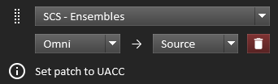
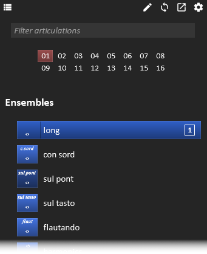
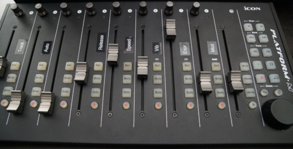

# First Run

* Open Reaper's Actions list (the `?` key by default) and run `Script: Reaticulate_Main.lua`
* The UI window can be docked by clicking the Dock icon in the toolbar 
  * After that you can control it like any other docked window in Reaper
* If you want Reaticulate to automatically start each time Reaper is launched (recommended), click the settings icon  and enable the autostart option

# Basics

Let's first get some terminology and basic operational stuff out of the way:

* A __patch__ refers to a set of articulations offered by some virtual instrument on a single channel
    * For example Spitfire's Chamber Strings Ensembles patch running in Kontakt
* __Banks__ define a set of articulations that typically describe some multi-articulation patch
    * __Factory banks__ are distributed with Reaticulate and you won't directly change these, but
      you can use them
    * __User banks__ are custom banks made by you
* Reaticulate works by translating incoming __program change__ MIDI messages to whatever different
  MIDI events your virtual instrument library needs to trigger articulation changes
    * Reaticulate calls these __output events__ and they're defined in the bank
* Because __articulations__ are activated by __program changes__ these terms are often used
  interchangeably in this documentation
* Reaticulate lets you assign up to 16 different banks to a track and provides a GUI and a bunch of actions
  to make it easy to trigger (i.e. activate) articulations
    * Where "trigger articulations" means either emitting program change messages or inserting them into MIDI items

# Track Setup

In order for Reaticulate to work on a track, you must first load the Reaticulate FX plugin at the
top of the FX chain. The job of the Reaticulate FX is to translate program change MIDI messages (as
emitted by Reaticulate's GUI) to the appropriate MIDI needed by the virtual instrument on that track
to switch articulations.

* Select the track
* Click 
  __Add Reaticulate FX__ which will be shown in Reaticulate's UI
* Once the FX is installed, the track configuration icon 
  will appear in Reaticulate's toolbar.  Click it to configure the track.
* Click 
  __Add Bank__

A *bank* is a collection of articulations that generally describes a multi-articulation patch of a
virtual instrument.  A track can contain a number of banks provided there are no conflicting
articulations (program numbers) between banks on the same track.

Once added, each bank has a few UI elements:
* A selection of one of the existing factory or user banks (see below)

* The __source channel__, which defaults to *Omni*
    * Program change MIDI messages observed on this channel will be processed according to this
      bank
    * Subsequent MIDI events (notes, CC, etc.) on this channel will be sent to the articulation's
      destination channel(s) (unless the articulation is specifically configured not to alter
      routing, though this is uncommon)
    * When a bank's source channel is *Omni* then this single bank can be used across multiple
      channels, where each channel can have a different articulation.  This lets you pull in the
      same patch on different channels (e.g. for layering or divisi) while using just one bank.
* The __destination channel__, which defaults to *Source*
    * As part of the bank definition, output events for an articulation can specify exactly which
      channels they should be sent to, but when no channel is given (which is usually the case),
      this channel is the one that will be used for the output events
    * Typically the destination channel just defines the channel the underlying VI patch is
      listening on
    * When set to *Source* it means that output events will be sent to the same MIDI channel the
      program change message came in on
* A delete button 
  which removes the bank from the track
* A drag handle 
  which lets you rearrange the order of banks on the track by dragging and dropping
* Optional info text 
  that may give some additional information on how to configure the patch to work with the bank

## Factory Banks

Banks for a number of existing VI libraries come bundled with Reaticulate.  These generally work
out of the box with the patch, or require minimal tweaks to the patch which will be indicated
in a message when you add a factory bank.  (For example, banks for Spitfire libraries usually
require setting the patch to *Locked to UACC*.)

You can use these to get started, but of course you're almost certainly going to want to roll your own.

## User Banks

<p class='warning'>
    In the alpha preview of Reaticulate, there is no GUI for creating custom banks.
    This means some manual text editing is necessary to configure banks.
    <a href=''><b>Click here to learn how to create your own custom banks for Reaticulate</b></a>.
</p>

# Usage

## GUI
Hopefully the GUI will be fairly intuitive.  Here are some tips that may not be obvious:


* The group of 16 numbers at the top of the UI indicate the __default channel__
    * The default channel is the channel on which articulations will be activated when you click an
      articulation button with the mouse
    * There are also a number of actions relating the default channel (see later)
* __Left clicking__ on an articulation will change articulations by sending the output events defined
  for that articulation in the bank using the default channel as the source channel for the articulation
    * If you have the MIDI editor open and step input is enabled, then left clicking will also
      insert the program change message in the MIDI item
* __Right clicking__ on the other hand will *always* insert a program change at the edit cursor
    * This also works from the arrange view
* When you left or right click an articulation, Reaticulate will focus the MIDI editor if it's open,
  or the arrange view if it's not.  This is *usually* what you want to avoid focus stealing
* When an articulation is activated, the source channel that articulation is active on is denoted by
  a number on the right edge of the articulation
    * If a bank's source channel is set to __Omni__ in the track configuration, then it's possible activate
      the articulation on multiple channels. All channels will be listed here.
* __Middle clicking__ an articulation will clear its assignment from all source channels (at least
  as far as the UI is concerned)
* There's no vertical scrollbar in the UI yet.  Use the __scroll wheel__ on your mouse to scroll the view as needed.
* You can adjust the zoom level of the UI by using ctrl-mousewheel
* As you hover over an articulation, the status bar at the bottom of the UI will describe what output events will be sent
* The articulations filter works by fuzzy substring match, so for example `trp` would match `trill P4`
    * And hitting escape when the filter is focused will clear it


## Actions

Reaticulate installs a number of Reaper actions that you can bind to keyboard shortcuts or MIDI
controller events.  Most of the actions are designed to make Reaticulate usable from a control
surface or tablet (e.g. running TouchOSC or Lemur).

All actions are prefixed with `Reaticulate` so you can easily find them by searching for
`Reaticulate` in Reaper's action list.

| Action | Description
|--------|--------------
| `Activate articulation by CC on default channel` | When you bind a CC to this action, sending the CC with value `<n>` will activate the articulation defined by program `<n>`.  This is the action you probably want to use from a control surface.  The articulation is activated on the default channel (described above).
| `Activate articulation by CC on channel <n>` | Like the previous action, except explicitly activates the articulation on channel `<n>` instead of the default channel.  There are 16 separate actions for the 16 different MIDI channels.
| `Set default MIDI Channel by CC` | Sending value `<n>` on the CC bound to this action will set the default channel to `<n>`.
| `Set default MIDI Channel to <n>` | Sets the default channel to `<n>`. There are 16 separate actions for the 16 different MIDI channels.
| `Activate articulation by CC in group <n> on default channel (MIDI CC relative or mousewheel)` | Scrolls through the articulations in group `<n>`.  It can be convenient to bind this action to an encoder as a quick way to flip through articulations from a control surface.
| `Activate previous/next articulation in group <n> on default channel` | These actions can be assigned to previous/next keys (or control surface buttons) to discretely scroll through the articulations on group `<n>`
| `Disable/Enable/Toggle CC feedback to MIDI feedback device` | If CC feedback is configured (see below), these actions control whether or not it's active
| `Dump current CC values on select track to MIDI feedback device` | Replays all last seen CCs on all channels to the MIDI feedback device (if configured).


# CC Feedback to Control Surface

## Overview

MIDI controllers that send CCs can sometimes also *receive* those same CCs and use those values to set the
controller's current state.  There are many devices with this capability, but some examples are:
* [Komplete Kontrol](https://www.native-instruments.com/en/products/komplete/keyboards/) keyboards
  where the encoders are configurable

* [MIDI Fighter Twister](https://store.djtechtools.com/products/midi-fighter-twister)
* [iCON Platform-M](http://iconproaudio.com/product/platform-m-plus/) (when configured in custom
  mode)

Many control surfaces with motorized faders (such as the one depicted right) can be configured such
that the faders transmit MIDI CC values and can receive CCs back to move the faders to the new
values.

Even if your control surfaces lacks a custom mode to work directly with CCs (and supports only e.g.
Mackie Control Protocol [MCP] or HUI), if you're particularly enterprising, it's possible to shim a
translation layer between Reaper and the controller.  For example, with a control surface supporting
MCP, software such as [Bome MIDI Translator Pro](https://www.bome.com/products/miditranslator) could
be used to translate between CCs on the DAW side and pitch bend messages (used by MCP) on the
control surface side.

Reaticulate provides a built-in mechanism to transmit CC values to a MIDI controller:
* When a track is selected, it can send all last-seen CCs across all channels on that track.  This
  causes your control surface to sync its faders/encoders as you select different tracks.
* During playback, the CCs on all channels from the first selected track will be streamed back to
  the control surface in real time.

## Configuration

To configure this:
* Click the settings icon  in the toolbar
* In the *CC Feedback to Control Surface* section select your control surface's MIDI device
    * __Important!__ This device must be enabled for MIDI output within Reaper first, before selecting
      the MIDI device.  (Clicking the `Device must be enabled for output` text will open Reaper's
      Settings.)

## MIDI Bus

You almost certainly want to leave this set to 1, in which case the CC events sent to the control
surface are standard MIDI.

More esoteric custom configurations may benefit from using a different MIDI bus for the outbound
CCs.  When a bus other than 1 is used, Reaper will output SysEx MIDI events like this:

```
F0 FF 52 50 62 0F B0 0B 30 F7
```

Where:
* `0F` is the MIDI bus offset from 0 (so `0F` is MIDI bus 16)
* `B0 0B 30` is the standard CC event (in this example, channel 1, CC 11, value 48)
